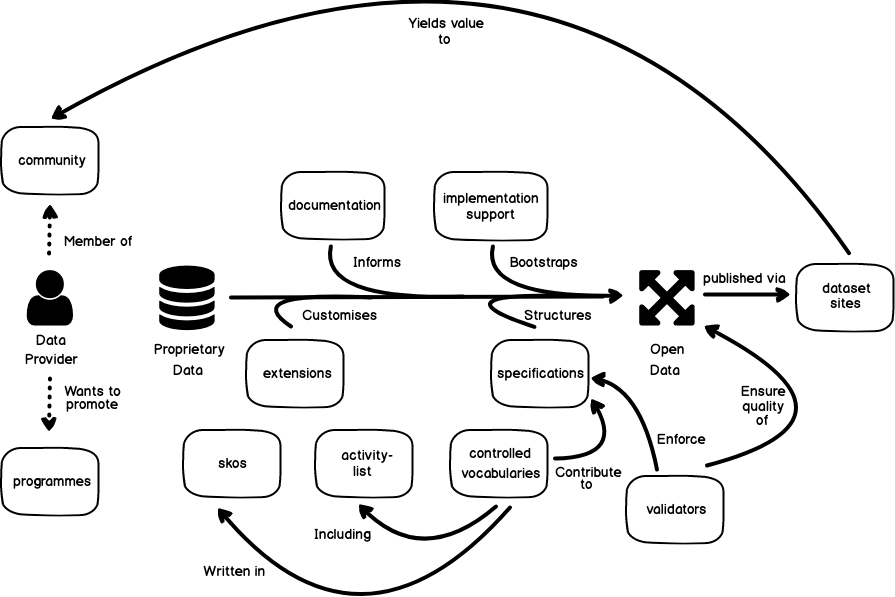

# Overview

Over the past three years, OpenActive has grown fast, and in several directions at once. The result has been a rich codebase supporting wide functionality - and quite a large number of repositories \('repos'\) on GitHub, the platform on which we host all our code.

At first glance, the sheer number of GitHub repos can seem overwhelming. Almost all of these, however, are quite small and modular, working together with other small repos to support larger functionality. The purpose of the pages in this section is to provide a top-down overview of this larger functionality, which will serve to clarify the role of each individual repo and the structure of the codebase as a whole.

## GitHub Topics

Within GitHub itself, a repo's top-level functionality is indicated using [GitHub Topics](https://help.github.com/en/articles/classifying-your-repository-with-topics). This means, amongst other things, that you can search for all repos dedicated to a particular functionality using the syntax `topic:topic-name` in the GitHub search bar.

The following topics are used for OpenActive GitHub repos:

* `archived`
* `activity-list`
* `controlled-vocabulary`
* `community`
* `dataset-publication`
* `documentation`
* `extensions`
* `implementation-support`
* `pre-release`
* `programmes`
* `rpde`
* `skos`
* `specifications`
* `validators`

Note that some repos may be tagged with more than one topic. Each of these topics is discussed in more detail in the pages in this section.


**`archived` and `pre-release` repositories**  
Both these topics are used to indicate repositories whose contents are not recommended for use in their current state - in the case of `archived`, because they are now obsolete and no longer under active development, and for `pre-release` because they are still in the 'bootstrapping' phase and not yet useable as they stand.

Although developers are of course welcome to clone, download, or make pull requests on the codebase, no guarantees are made as to the behaviour of `archived` or `pre-release` codebases or its future development direction.


## How the Topics Relate

If the purpose of all the repos had to be summarised in a single diagram and paragraph, they might look something like this.

A member-organisation of the OpenActive \(OA\)`community` wishes to publish its proprietary data openly. Developers at the organisation consult OpenActive `documentation` and build upon `implementation-support` tools to remediate this data, using OA`validators` to check that the end result conforms to the relevant `specifications;`meanwhile, the organisation's bespoke functionality is provided by custom `extensions` The end result is an `rpde` feed of bookable Opportunity data, enriched by `skos`-based `controlled-vocabularies` - especially by the `activity-list.` This feed is then made available via the organisation's `dataset-publication` site, where the open data it contains is used to promote the organisation's `programmes` - and, of course, can have value added to it by other members of the `community.`

