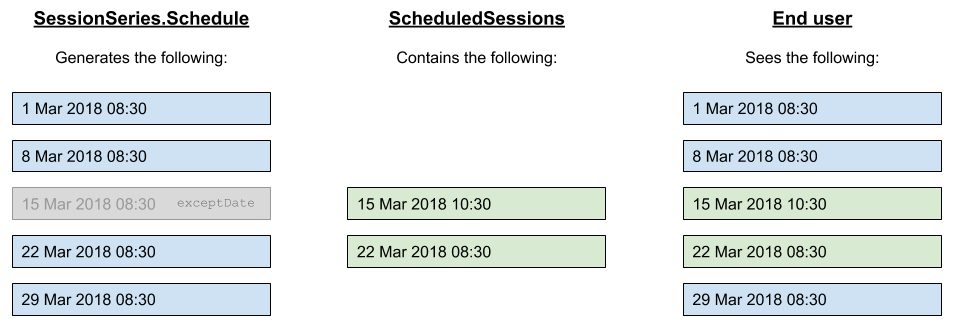

# Schedules

A [`Schedule`](../data-model/types/schedule.md) is a representation of a recurrence rule, compatible with the [iCalendar specification](https://tools.ietf.org/html/rfc5545), designed to be extrapolated by the data user into individual occurrences.

A [`PartialSchedule`](../data-model/types/partialschedule.md), by contrast, **must** **not** be extrapolated by the data user, and is for information only.

## Outputting a `Schedule` to a feed

A [`Schedule`](../data-model/types/schedule.md) **must** be used for systems that display occurrences of a sessions directly from a recurrence rule, rather than first materialising them in a database.

When `ScheduledSession`s are included in a feed or `subEvent`, they **must not** include all occurrences that are generated from the recurrence rule, and instead only include those events that either:

1. Have bookings associated \(i.e. where `remainingAttendeeCapacity` &lt; `maximumAttendeeCapacity`\)
2. Are an exception to the recurrence rule defined in the `Schedule`.
3. Have any other properties that differ from those defined in `SessionSeries`.

When such `ScheduledSession`s are included, the `Schedule` **must** also include an `idTemplate`, such as the below, which matches the pattern of the `@id` of the `ScheduledSession`s \(noting the `startDate` placeholder **must** use a string format of `YYYY-MM-DDThh-mm-ssZ` \(e.g. `1997-07-16T19-20-00Z`\):

```javascript
"idTemplate": "https://api.example.org/session-series/123/{startDate}"
```

Such events would need to have been materialised in a database within the booking system already, so **under no circumstances should new occurrence records be generated for the sole purpose to output to an OpenActive feed**.

This constraint is necessary to prevent recurrence rules from creating a high volume of redundant data in its ScheduledSessions feed. For example: if a `SessionSeries` has a recurrence rule for a weekly event with an `endDate` in 2050, only the `ScheduledSession`s that have been booked at least once or have been manually edited would appear in the ScheduledSessions feed.

## Processing a `Schedule` found in a feed

In order to process a [`Schedule`](../data-model/types/schedule.md), the data user must do the following:

1. Generate all occurrences from a `Schedule` in the future, taking into account the `exceptDate` property.
   * Take the `scheduledEventType`, property and use it for the `@type` property of each occurrence.
   * Render the generated `startDate` and `endDate` for each occurrence to UTC using a string format of `YYYY-MM-DDThh-mm-ssZ` \(e.g. `1997-07-16T19-20-00Z`\) for placeholder replacement.
   * Take the `idTemplate` property \(if provided\) and substitute the `startDate` placeholder with the calculated string value of `startDate` \(and do the same with `endDate`\). Use the resulting string as the value of the `@id` property for the occurrence.
   * Take the `urlTemplate` property \(if provided\) and substitute the `startDate` placeholder with the calculated string value of `startDate` \(and do the same with `endDate`\). Use the resulting string as the value of the `url` property for the occurrence.
2. Completely overwrite any generated occurrences with any explicitly defined occurrences \(e.g.`ScheduledSession`s found in a `subEvent` or ScheduledSession feed\), replacing the entire occurrence.

## Example

Extract from `SessionSeries` feed:

```javascript
{
  "@type": "SessionSeries",
  ...
  "eventSchedule": [
    {
      "@type": "Schedule",
      "repeatFrequency": "P1W",
      "startDate": "2018-03-01",
      "endDate": "2018-03-29",
      "startTime": "08:30",
      "endTime": "09:30",
      "byDay": [
        "https://schema.org/Thursday"
      ],
      "duration": "PT1H",
      "exceptDate": [
        "2018-03-15T08:30:00Z",
      ],
      "scheduleTimezone": "Europe/London",
      "scheduledEventType": "ScheduledSession",
      "idTemplate": "https://api.example.org/session-series/1402CBP20150217/{startDate}",
      "urlTemplate": "https://example.org/session-series/1402CBP20150217/{startDate}"
    }
  ]
}
```

Extract from `ScheduledSession` feed:

```javascript
{
  "state": "updated",
  "kind": "ScheduledSession",
  "id": "C5EE1E55-2DE6-44F7-A865-42F268A82C63",
  "modified": 1521565719,
  "data": {
    "@context": "https://openactive.io/",
    "@type": "ScheduledSession",
    "@id": "https://api.example.org/session-series/1402CBP20150217/2018-03-15T10-30-00Z",
    "identifier": "C5EE1E55-2DE6-44F7-A865-42F268A82C63",
    "superEvent": "https://example.com/api/session-series/1402CBP20150217",
    "startDate": "2018-03-15T10:30:00Z",
    "endDate": "2018-03-15T11:30:00Z",
    "duration": "PT1H",
    "eventStatus": "https://schema.org/EventScheduled",
    "maximumAttendeeCapacity": 10,
    "remainingAttendeeCapacity": 10,
    "url": "https://example.org/session-series/1402CBP20150217/2018-03-15T10-30-00Z"
  }
},
{
  "state": "updated",
  "kind": "ScheduledSession",
  "id": "C5EE1E55-2DE6-44F7-A865-42F268A82C64",
  "modified": 1521565719,
  "data": {
    "@context": "https://openactive.io/",
    "@type": "ScheduledSession",
    "@id": "https://api.example.org/session-series/1402CBP20150217/2018-03-22T08-30-00Z",
    "identifier": "C5EE1E55-2DE6-44F7-A865-42F268A82C64",
    "superEvent": "https://example.com/api/session-series/1402CBP20150217",
    "startDate": "2018-03-22T08:30:00Z",
    "endDate": "2018-03-22T09:30:00Z",
    "duration": "PT1H",
    "eventStatus": "https://schema.org/EventScheduled",
    "maximumAttendeeCapacity": 10,
    "remainingAttendeeCapacity": 3,
    "url": "https://example.org/session-series/1402CBP20150217/2018-03-22T08-30-00Z"
  }
}
```

Illustration of resulting opportunities presented to the end user:



